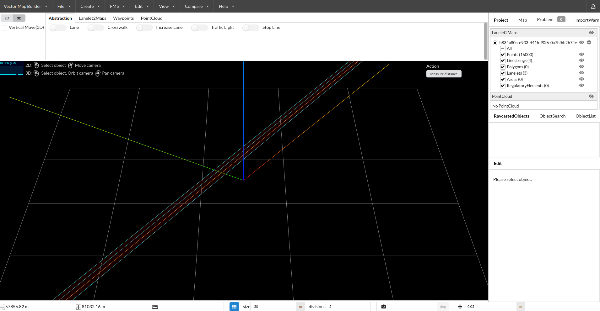

# Map conversion - OpenDRIVE => Lanelet2 : First attempt

## Progress

```
Autoware Foundation is studying the use of the scenarios in the Safety Pool database with Scenario Simulator v2. The Safety Pool scenario format is OpenSCENARIO v1.1 and the map format is OpenDRIVE. You need to convert the map from OpenDRIVE to Lanelet2 first.
```

As suggested by Igata-san, I reproduced the conversion steps. Following result, visualized via [Autoware Vector Map Builder](https://tools.tier4.jp/):



## Q&A

1. Is it the expected result?

2. Out of the 3 sample files you gave me via Google Drive, I can only convert the `.xodr`, not `.osm` and `.xosc`.

3. What are the next steps? I am thinking about converting this to a Docker file and make it a feature of Autoware map builder tool.